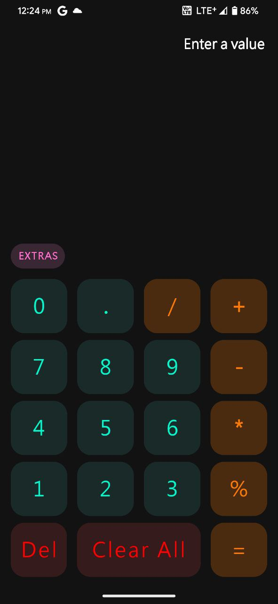
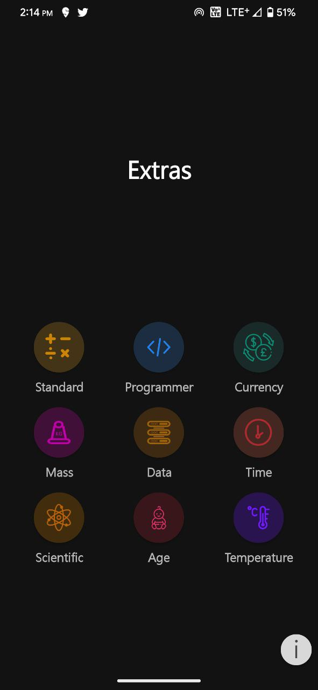
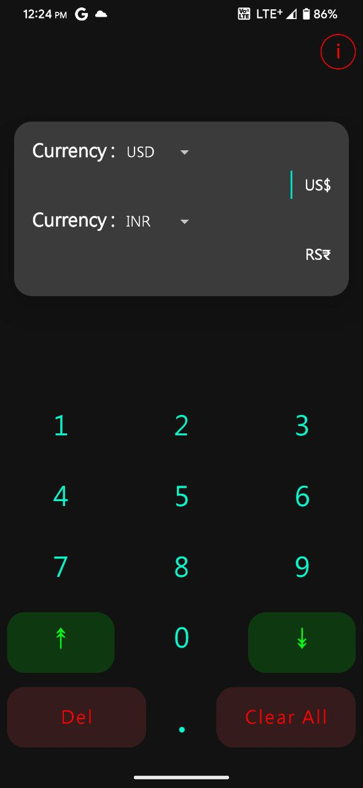
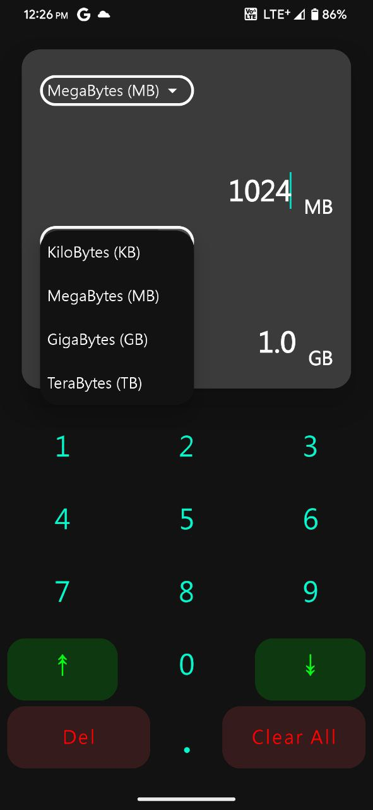
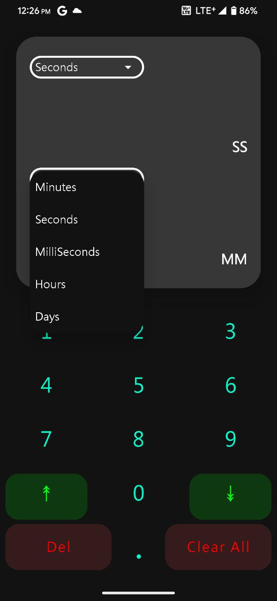
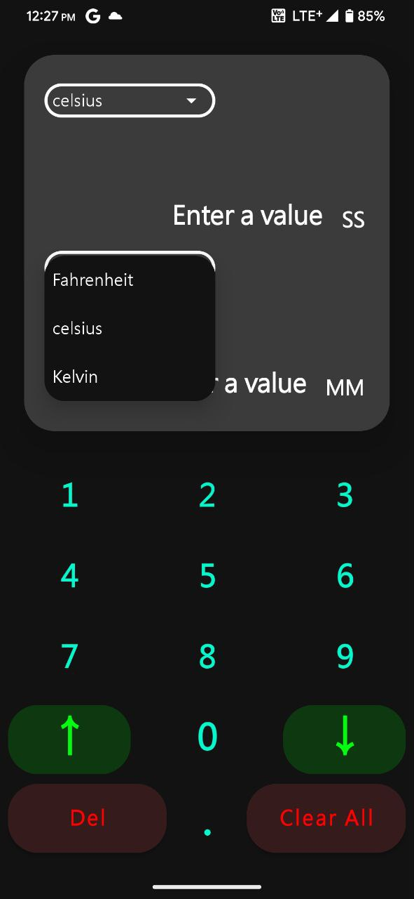
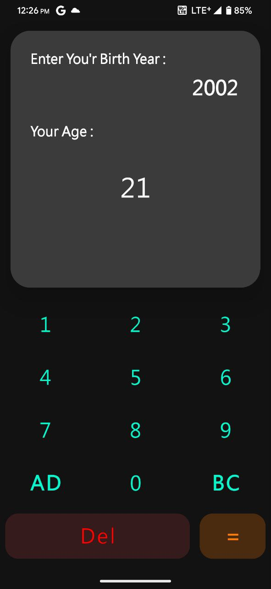

# Calculator
This app is really special for me its the first app where i actually took feedback and iterated over 
app ui and even add few calculation modes. I'll even add the different ui this app went thru and am
very proud of this app's ui i felt so good with what came out 😊

# UI Iteration
[**FIGMA**](https://www.figma.com/file/Dv4P0XTbglqq4p7gEgNVXw/Calculator-ui-iteration?type=design&node-id=0%3A1&mode=design&t=XS1oveGP95s2wEKB-1)

# Things I Learned
- XML
- Material UI
- UI Iteration
- Use Third Party Math Parser

# Screenshots
## Light Mode
| 
Standard
 | 
Extras
 | 
Currency
 | 
Currency Info
   |
|-----------------------------------------|---------------------------------------|-----------------------------------------|------------------------------------------------|
|  |  |  |  |

| 
Data
     | 
Time
      | 
Temperature
            | 
Age
 |
|-----------------------------------------|------------------------------------------|-------------------------------------------------------|:----------------------------------:|
|      |       |             |  |

## Dark Mode
| 
Standard
 | 
Extras
 | 
Currency
 | 
Currency Info
 |
|-----------------------------------------|---------------------------------------|-----------------------------------------|----------------------------------------------|
|          |          |          |        |

| 
Data
 | 
Time
 | 
Temperature
 | 
Age
 |
|-------------------------------------|-------------------------------------|--------------------------------------------|:----------------------------------:|
|          |          |          |          |

# Thank You
Thank you for checking out this app i hope this helps in some way or other this app doesn't have 
perfect ui but i still like the way ui was iterated and i could show it. Thank you for coming by 
hope you have a good day :) 